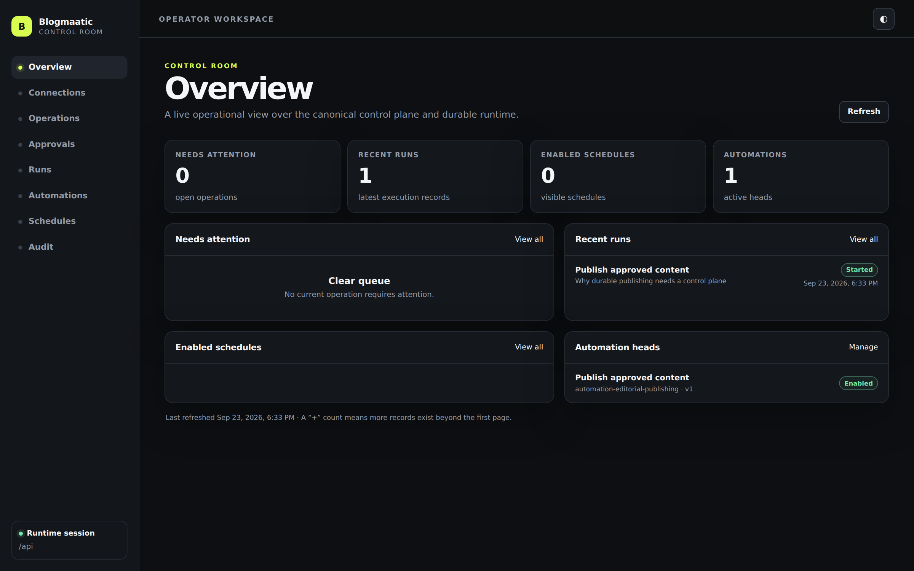
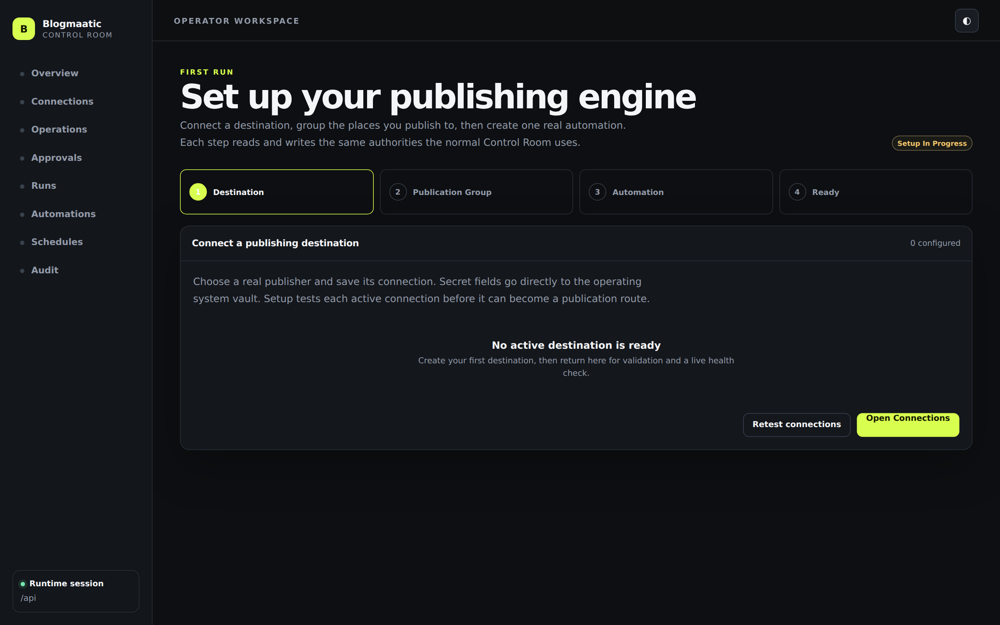
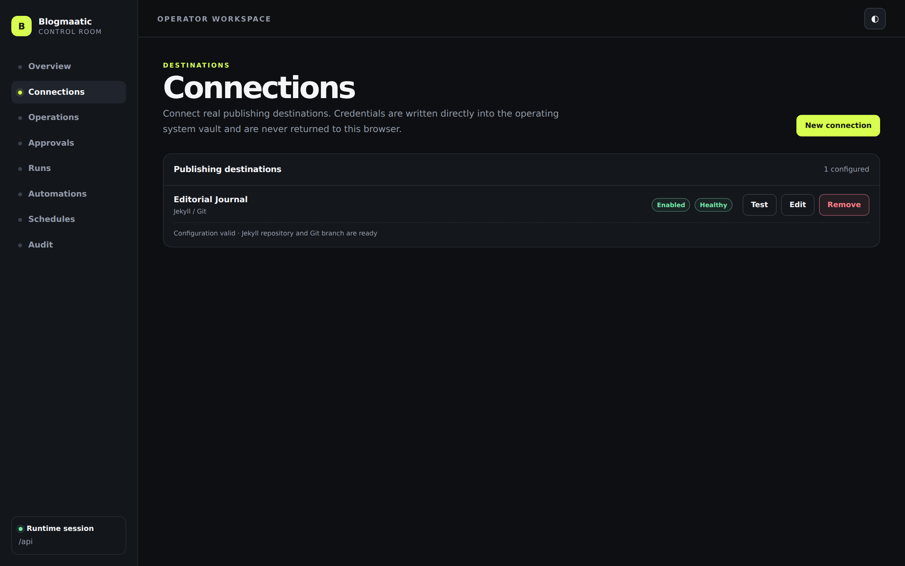
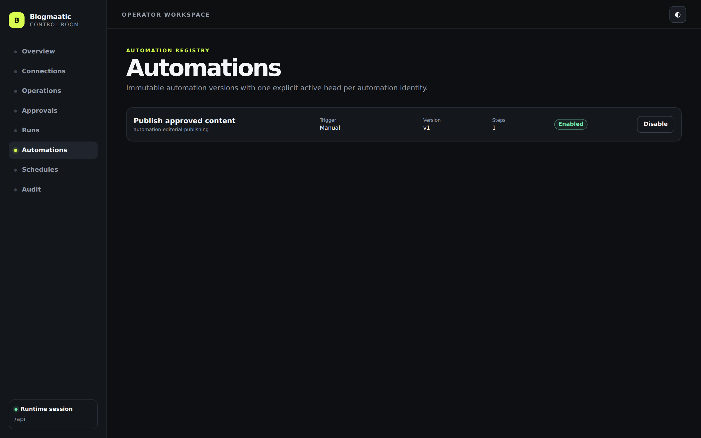
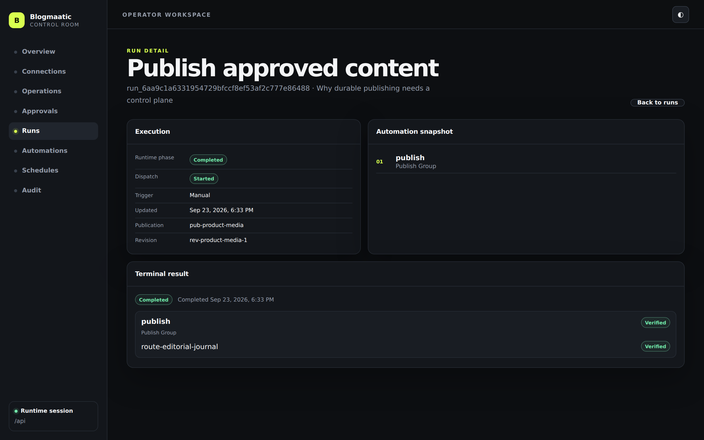

# Blogmaatic

Blogmaatic is a modular **publication automation control plane** for maintaining one logical publication across multiple publishing hubs.

It combines durable automation, policy, destination-aware content projection, provider extensions, verification, reconciliation, and an operator Control Room. Provider behavior stays outside the core: Jekyll/Git, WordPress, LinkedIn, Facebook, and future destinations connect through extension contracts rather than provider branches in the publication kernel.

## Control Room

The product screenshots below are captured from the **real running Blogmaatic runtime and Control Room**, not a mock UI. The capture fixture creates an actual Jekyll/Git connection, Publication Group, Automation, completed durable publication run, and verification evidence before taking the images. Capture provenance lives in [`docs/screenshots/capture-manifest.json`](docs/screenshots/capture-manifest.json).

<p align="center">
  
</p>

<table>
  <tr>
    <td width="50%"></td>
    <td width="50%"></td>
  </tr>
  <tr>
    <td><strong>Guided first run</strong><br/>Connect a real destination, validate health, create a Publication Group, and wire the first Automation through the same authorities used after setup.</td>
    <td><strong>Connection Manager</strong><br/>Extension-driven destination settings, write-only credentials, live health, and lifecycle management without browser-owned connection truth.</td>
  </tr>
  <tr>
    <td width="50%"></td>
    <td width="50%"></td>
  </tr>
  <tr>
    <td><strong>Durable automation</strong><br/>Versioned publishing automations remain owned by the control plane and durable runtime.</td>
    <td><strong>Run evidence</strong><br/>Inspect durable execution, delivery receipts, and verification truth after real publication work.</td>
  </tr>
</table>

See the full canonical visual set in [`docs/screenshots/`](docs/screenshots/README.md).

## Architecture

The executable authority chain is:

```text
Trigger / Schedule / Operator
            ↓
       Control Plane
            ↓
    Durable Automation
            ↓
     Publication Group
            ↓
       Policy Engine
            ↓
 Variant / Projection
            ↓
    Extension Runtime
            ↓
 Delivery / Verification
            ↓
 Receipt / Reconciliation
```

The local application adds:

```text
Control Room
    ↓
Operator API
    ↓
Control Plane + SQLite
    ↓
Restate durable runtime
    ↓
Publication Kernel
    ↓
Publisher extensions
```

Current real publisher classes prove materially different delivery models:

- **Jekyll/Git** — files, assets, Git commits/push, build verification, drift repair.
- **WordPress REST** — authenticated CMS API, media, taxonomy, scheduling, remote IDs and update-in-place reconciliation.
- **LinkedIn** — constrained social projection, fidelity reporting, opaque post identity and safe partial updates.
- **Facebook Pages** — Graph API text/link/image/multi-image/scheduled posts with immutable-drift protection.

Restate is an execution adapter, not Blogmaatic's domain model. SQLite owns local control-plane/projection facts; Restate owns durable workflow journaling, replay, timers, and approval suspension.

## Consumer installation

Blogmaatic's verified runtime is self-contained: the target machine does **not** need a repository checkout, Node.js, npm, or its own Restate installation.

The native installation layout is:

```text
/opt/blogmaatic/                compiled runtime, Control Room, Node, Restate
/usr/local/bin/blogmaatic       stable command wrapper
```

### Linux x64

Trusted releases publish a Debian package as the primary installer and retain the portable archive as a fallback distribution:

```bash
sudo dpkg -i blogmaatic-<version>-amd64.deb
blogmaatic version
blogmaatic init
blogmaatic doctor
blogmaatic start
```

After `blogmaatic start`, open the one-time Control Room launch URL and complete the guided first run to configure a publisher destination, validate it, create a Publication Group, and register the first Automation. The legacy CLI Jekyll bootstrap flags remain available for explicit scripted setup, but they are not required for the normal consumer path.

### macOS Apple Silicon and Intel

Trusted releases publish native `.pkg` installers. The release path signs the payload with Developer ID + Hardened Runtime, grants bundled Node only the JIT entitlement required by V8, signs the installer with Developer ID Installer, notarizes it with Apple's notary service, and staples the resulting ticket before publication.

The portable macOS archive remains a build/clean-install proof and is **not** published as a consumer release asset because it is created before the Developer ID signing/notarization boundary.

After installation:

```bash
blogmaatic version
blogmaatic init
blogmaatic doctor
blogmaatic start
```

`blogmaatic start` prints a **one-time Control Room launch URL**. Opening it exchanges the launch capability for a runtime-memory `HttpOnly; SameSite=Strict` session cookie plus an origin-bound browser proof. The bundled same-origin `/api` proxy injects the Operator API bearer server-side; the bearer never enters browser JavaScript. The launch capability is consumed after first use and a new browser session is generated on the next runtime start.

`blogmaatic token` remains an advanced command for an explicit external Operator API client. It is not part of the normal consumer Control Room flow.

The application state directory is separate from the installation, so replacing the installed runtime does not move publication/run state, the operator credential, SQLite control-plane state, or managed Restate state.

Windows currently requires `restate.mode=external`; Blogmaatic does not claim an unverified managed Restate binary path on Windows.

See [`docs/architecture/distribution.md`](docs/architecture/distribution.md) for the artifact and clean-install proof contract and [`docs/operations/releases.md`](docs/operations/releases.md) for trusted release, signing, notarization, provenance, and version/tag authority.

## Main packages

- `@blogmaatic/core` — publication domain, policy, projection state, delivery, verification and reconciliation.
- `@blogmaatic/variants` — destination capability profiles, adaptation and fidelity reporting.
- `@blogmaatic/extension-sdk` — extension manifests, connections, health and lifecycle.
- `@blogmaatic/secrets` — scoped secret-reference resolution and managed OS-vault authority.
- `@blogmaatic/state-sqlite` — durable remote projection identity.
- `@blogmaatic/automation` — provider-neutral automation definitions and run contracts.
- `@blogmaatic/automation-restate` — durable Restate execution adapter.
- `@blogmaatic/control-plane` — automation registry, Publication Group registry, event routing, schedules, deterministic run identity and audit authority.
- `@blogmaatic/operator-api` — authenticated operator/control-plane HTTP surface.
- `@blogmaatic/operator-client` — browser-safe typed client for the operator API.
- `@blogmaatic/extension-jekyll-git` — real Jekyll/Git publisher.
- `@blogmaatic/extension-wordpress-rest` — real WordPress publisher.
- `@blogmaatic/extension-linkedin-rest` — real LinkedIn organization-post publisher.
- `@blogmaatic/extension-facebook-pages` — real Facebook Pages publisher.
- `@blogmaatic/control-room` — React/Vite operational UI and guided first-run experience.
- `@blogmaatic/runtime` — local application composition, connection authority, managed Restate lifecycle and consumer CLI.

## Development

Development uses a committed dependency graph and exact install semantics.

Requirements:

- Node.js 24.21.x
- npm 11.19.x
- Git
- Docker for the existing Restate Testcontainers integration burn
- Chromium/Chrome only when regenerating product screenshots locally

```bash
npm ci --ignore-scripts
npm run check
```

For live Control Room development, initialize and start the real local runtime first. In a second shell, start Vite:

```bash
npm run runtime:init   # first run only
npm run runtime:start

# second shell
npm run dev:control-room
```

The Vite development proxy reads the existing operator credential **server-side** from Blogmaatic's runtime data directory and injects it into `/api` requests. The bearer token is never exposed to the browser or a `VITE_*` variable. If the runtime uses a custom data directory, point the dev proxy at the same directory:

```bash
BLOGMAATIC_DEV_DATA_DIR=/absolute/path/to/blogmaatic-data npm run dev:control-room
```

`BLOGMAATIC_DEV_API_TARGET` may be used only to point the server-side dev proxy at a non-default local Operator API address. Development fails closed when the operator credential file is missing or malformed.

To regenerate the canonical product screenshots against the real runtime:

```bash
npm run build
npm run product:screenshots
```

The capture contract and gallery live in [`docs/screenshots/`](docs/screenshots/README.md). Screenshots must come from the real runtime-backed Control Room; generated concept art and browser-only mock state are not accepted as product evidence.

To burn a local portable distribution after building:

```bash
npm run build
rm -rf node_modules
npm ci --omit=dev --ignore-scripts
npm run distribution:stage
```

To build the native installer from that stage:

```bash
npm run distribution:native
```

On macOS CI, Distribution Quality uses `--adhoc-signed` to exercise Hardened Runtime and Node's JIT entitlement without production signing credentials. The trusted tag workflow is the only path that uses Developer ID and notarization credentials.

Provider credentials belong in connection/secrets infrastructure, never in `@blogmaatic/core`. Durable-runtime code belongs behind the automation adapter. Trigger, schedule and run authority belongs in the control plane rather than extensions.

## Architecture documents

- [`control-room.md`](docs/architecture/control-room.md)
- [`publication-kernel.md`](docs/architecture/publication-kernel.md)
- [`extensions.md`](docs/architecture/extensions.md)
- [`wordpress-rest.md`](docs/architecture/wordpress-rest.md)
- [`social-projections.md`](docs/architecture/social-projections.md)
- [`facebook-pages.md`](docs/architecture/facebook-pages.md)
- [`durable-automation.md`](docs/architecture/durable-automation.md)
- [`control-plane.md`](docs/architecture/control-plane.md)
- [`runtime-bootstrap.md`](docs/architecture/runtime-bootstrap.md)
- [`distribution.md`](docs/architecture/distribution.md)
- [`release operations`](docs/operations/releases.md)
- [`product screenshot manifest`](docs/screenshots/README.md)
