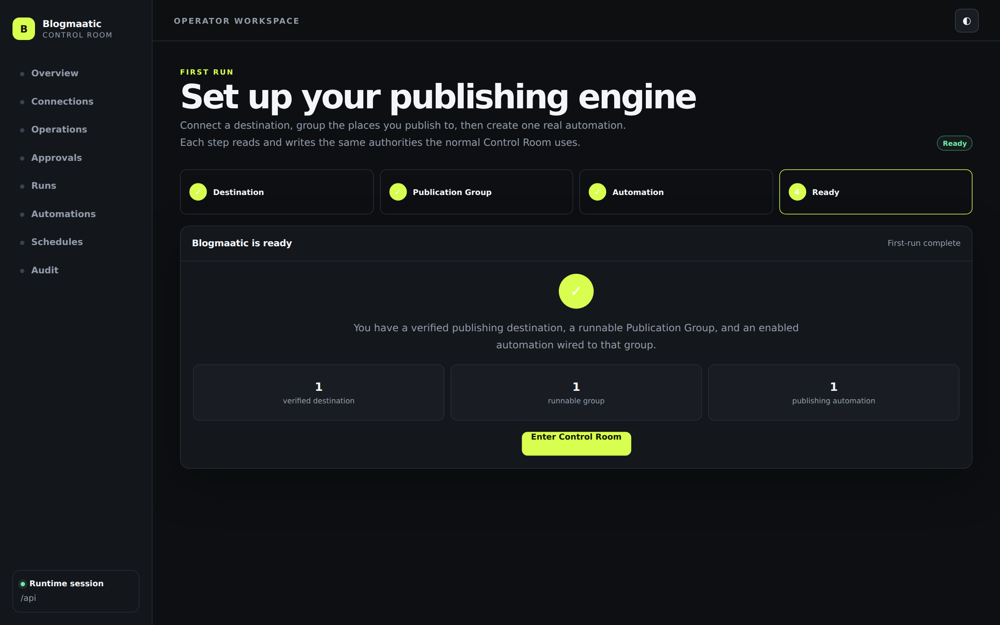
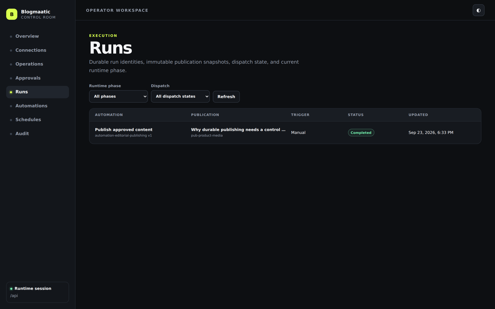
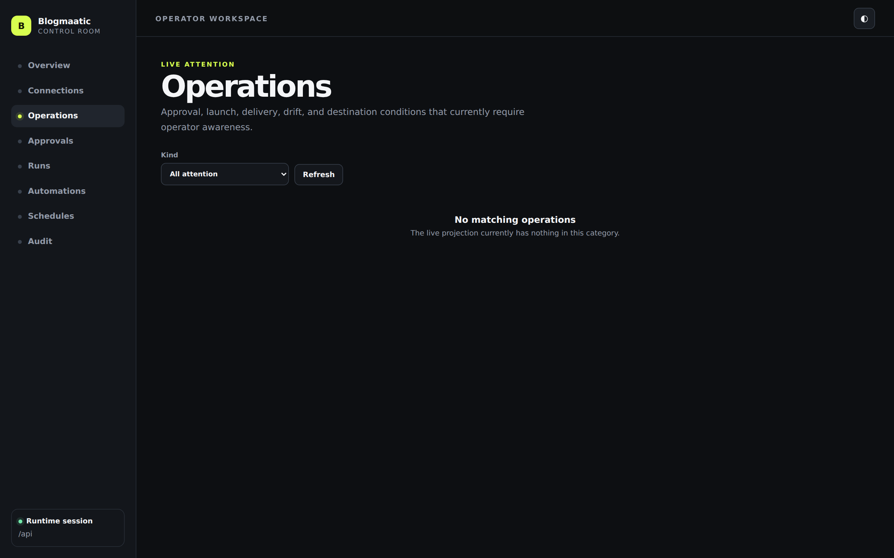

# Product screenshot manifest

These images are **real captures of the running Blogmaatic Control Room**, not mockups, composites, Figma exports, or hand-built marketing replicas.

The canonical capture command is:

```bash
npm run build
npm run product:screenshots
```

The capture harness boots a fresh managed local runtime, opens the actual bundled Control Room in headless Chromium, creates a real Jekyll/Git connection through the Operator API, validates it, creates a durable Publication Group, registers an Automation, completes a real durable publication run, and then captures the product surfaces at a fixed premium desktop viewport.

`capture-manifest.json` records the exact source commit, viewport, fixture authority, routes, and screenshot filenames used for each capture.

## Canonical gallery

### First-run setup


Fresh application state with no configured publisher. This proves the real derived first-run experience rather than a browser-local demo flag.

### First-run ready



The same runtime after a verified destination, runnable Publication Group, and enabled publishing Automation exist.

### Connections


The real Connection Manager with a live Jekyll/Git destination and runtime health result. Connection forms and routes remain extension-contract driven.

### Control Room overview


The normal operator landing surface after first-run completion, backed by current control-plane and runtime truth.

### Automations


The durable Automation registry surfaced through the normal Control Room.

### Runs



Real durable run history after the screenshot fixture completed an actual publication.

### Run detail


The completed durable run and its delivery/verification evidence.

### Operations



The operator attention surface backed by current operation truth.

## Media rules

Product documentation and release-facing material should use these canonical captures when the corresponding feature is discussed. Do not substitute generated concept art for a product screenshot, do not paint fake data into screenshots, and do not capture pages against browser-owned stub state.

When UI structure or a represented feature materially changes, regenerate the gallery from the real runtime and review the images before release. Secret values, Operator API bearer credentials, vault locators, and private user content must never appear in product media.
